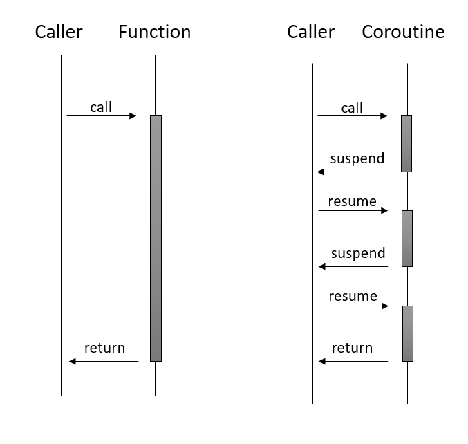

# 코루틴과 Async/Await

### 코루틴이란?

- 코루틴은 비선점형 멀티태스킹을 수행하는 일반화한 서브루틴이다
- 코루틴은 실행을 일시 중단하고 재개할 수 있는 여러 진입 지점을 허용한다
    - 서브루틴 → 함수
    - 비선점형 → 멀티태스킹의 각 작업을 수행하는 참여자들의 실행을 운영체제가 강제로 일시 중단시키고 다른 참여자를 실행하게 만들 수 없다는 뜻



### 코틀린의 코루틴 지원: 일반적인 코루틴

- 코틀린은 특정 코루틴을 언어가 지원하는 형태가 아니라 코루틴을 구현할 수 있는 기본 도구를 언어가 제공함
- 기본 기능은 kotlin.coroutine 패키지 밑에 있음
- 기본 기능을 활용한 다양한 형태의 코루틴들은 kotlinx.coroutines 밑에 있음

## 여러 가지 코루틴

### Kotlinx.coroutines.CoroutineScope.launch

```kotlin
package coroutine

import kotlinx.coroutines.GlobalScope
import kotlinx.coroutines.launch
import java.time.LocalDateTime
import java.time.temporal.ChronoUnit

fun now() = LocalDateTime.now().toLocalTime().truncatedTo(ChronoUnit.MILLIS)
fun log(msg: String) = println("${now()} : ${Thread.currentThread()}: ${msg}")

fun launchInGlobalScope() {
    GlobalScope.launch {
        log("coroutine started")
    }
}

fun main(args: Array<String>) {
    log("main() started")
    launchInGlobalScope()
    log("launchInGlobalScope() executed")
    Thread.sleep(5000L)
    log("main() terminated")
}

/*
* // 실행결과
* 22:22:56.079 : Thread[main,5,main]: main() started
* 22:22:56.169 : Thread[main,5,main]: launchInGlobalScope() executed
* 22:22:56.179 : Thread[DefaultDispatcher-worker-1,5,main]: coroutine started
* 22:23:01.177 : Thread[main,5,main]: main() terminated
* */
```

- launch는 코루틴을 job으로 반환하며, 만들어진 코루틴은 기본적으로 즉시 실행된다
- 메인 함수와 GlobalScope.launch가 만들어낸 코루틴은 서로 다른 스레드에서 실행된다
- sleep 부분을 없애면 GlobalScope.launch는 스레드 생성,실행되기 전 메인 스레드 제어를 바로 main()으로 돌려주게 되어 코루틴은 아예 실행되지 않게 됨
    - 방지법
        - 비동기적으로 launch를 실행
        - 예시코드처럼 launch가 끝날때까지 기다려야 함
        - runBlocking()
            - `runBlocking`은 `CoroutineScope`의 확장 함수가 아닌 일반 함수이기 때문에 별도의 코루틴 스코프 객체 없이 사용 가능

```kotlin
fun runBlockingExample() {
    runBlocking {
        launch {
            log("coroutine started")
        }
    }
}

// 실행결과
22:29:43.972 : Thread[main,5,main]: main() started
22:29:44.069 : Thread[main,5,main]: coroutine started
22:29:44.071 : Thread[main,5,main]: runBlockingExample() executed
22:29:44.071 : Thread[main,5,main]: main() terminated
```

사용 스레드가 모두 main으로 바뀌었다

### yield

코루틴들은 서로 yield()를 해주며 협력 가능

```kotlin
package coroutine

import kotlinx.coroutines.delay
import kotlinx.coroutines.launch
import kotlinx.coroutines.runBlocking
import kotlinx.coroutines.yield
import java.time.LocalTime.now

fun log(msg: String) = println("${now()} : ${Thread.currentThread()}: ${msg}")

fun yieldExample() {
    runBlocking {
        launch {
            log("1")
            yield()
            log("3")
            yield()
            log("5")
        }
        log("after first launch")
        launch {
            log("2")
            delay(1000L)
            log("4")
            delay(1000L)
            log("6")
        }
        log("after second launch")
    }
}

fun main(args: Array<String>) {
    log("main() started")
    yieldExample()
    log("after runBlocking")
    log("yieldExample() executed")
    log("main() terminated")
}

// 실행결과
22:34:47.632776 : Thread[main,5,main]: main() started
22:34:47.723647 : Thread[main,5,main]: after first launch
22:34:47.727576 : Thread[main,5,main]: after second launch
22:34:47.733092 : Thread[main,5,main]: 1
22:34:47.734445 : Thread[main,5,main]: 2
22:34:47.741314 : Thread[main,5,main]: 3
22:34:47.741435 : Thread[main,5,main]: 5
22:34:48.755266 : Thread[main,5,main]: 4
22:34:49.762206 : Thread[main,5,main]: 6
22:34:49.767218 : Thread[main,5,main]: after runBlocking
22:34:49.767466 : Thread[main,5,main]: yieldExample() executed
22:34:49.767547 : Thread[main,5,main]: main() terminated
```

- 실행순서를 보면 launch는 즉시반환된다
- runBlocking은 내부 코루틴이 끝난 후 반환된다
- delay → yield 였다면 1,2,3,4,5,6 이었을 것

### kotlinx.coroutines.CoroutineScope.async

- async는 사실상 launch와 같은 일을 한다
- 차이는 luanch는 job을 반환하지만 async는 deffered를 반환
- job은 unit을 돌려주는 Deffered<Unit> 이라고 생각해도 됨
- 따라서 async는 코드 블록을 비동기로 실행하며 Deffered의 await()을 사용해 결과값을 받아서 사용할 수 있음

```kotlin
fun sumAll() {
    runBlocking {
        val d1 = async { delay(1000L); 1 }
        log("after async(d1)")
        val d2 = async { delay(2000L); 2 }
        log("after async(d2)")
        val d3 = async { delay(3000L); 3 }
        log("after async(d3)")

        log("1+2+3 = ${d1.await() + d2.await() + d3.await()}")

        log("after await all & add")
    }
}

// 실행결과
22:52:04.752963 : Thread[main,5,main]: after async(d1)
22:52:04.786915 : Thread[main,5,main]: after async(d2)
22:52:04.787700 : Thread[main,5,main]: after async(d3)
// 3초 텀
22:52:07.832284 : Thread[main,5,main]: 1+2+3 = 6
22:52:07.832515 : Thread[main,5,main]: after await all & add
```

- 비동기 코드가 늘어날때 async/await을 사용한 비동기가 효과를 봄!

## 코루틴 컨텍스트와 디스패처

- `CoroutineContext` 실제로 코루틴이 실행 중인 여러 작업(Job 타입)과 디스패처를 저장하는 일종의 맵
- 코틀린 런타임은 이 `CoroutineContext` 를 사용해 다음에 실행할 작업을 선정하고, 어떻게 스레드에 배정할지 대한 방법을 결정

```kotlin
package coroutine

import kotlinx.coroutines.Dispatchers
import kotlinx.coroutines.launch
import kotlinx.coroutines.newSingleThreadContext
import kotlinx.coroutines.runBlocking

fun dispatcherExample() {
    runBlocking {
        launch { // 부모 컨텍스트를 사용 이경우(main)
            println("main runBlocking : I'm working in thread ${Thread.currentThread().name}")
        }

        launch(Dispatchers.Unconfined) { // 특정 스레드에 종속되지 않음 ? 메인 스레드 사용
            println("Unconfined : I'm working in thread ${Thread.currentThread().name}")
        }

        launch(Dispatchers.Default) { // 기본 디스패처를 사용
            println("Default : I'm working in thread ${Thread.currentThread().name}")
        }

        launch(newSingleThreadContext("MyOwnThread")) { // 새 스레드 사용
            println("newSingleThreadContext : I'm working in thread ${Thread.currentThread().name}")
        }
    }
}

fun main(args: Array<String>) {
    dispatcherExample()
}

// 실행결과
Unconfined : I'm working in thread main
Default : I'm working in thread DefaultDispatcher-worker-1
main runBlocking : I'm working in thread main
newSingleThreadContext : I'm working in thread MyOwnThread
```

같은 Launch라도 전달하는 컨텍스트에 따라 다른 스레드상에서 코루틴 실행됨

## 코루틴 빌더와 일시 중단 함수

- 코루틴 빌더
    - launch
    - async
    - runblocking
    - produce
        - 정해진 채널로 데이터를 스트림으로 보내는 코루틴을 만든다. 이 함수는 ReceiveChannel<>을 반환한다. 그 채널로부터 메시지를 전달받아 사용할 수 있다(Publisher)
    - actor
        - 정해진 채널로 메시지를 받아 처리하는 액터를 코루틴으로 만든다. 이 함수가 반환하는 sendChannel<> 채널의 send() 메서드를 통해 액터에게 메시지를 보낼 수 있다(Subscriber)
- 일시 중단 함수
    - delay
    - yield
    - withContext
        - 다른 컨텍스트로 코루틴을 전환한다
    - withTimeout
        - 코루틴이 정해진 시간 안에 실행되지 않으면 예외를 발생시키게 한다
    - withTimeoutOrNull
        - 코루틴이 정해진 시간 안에 실행되지 않으면 null을 결과로 돌려준다
    - awaitAll
        - 모든 작업의 성공을 기다린다. 작업 중 어느 하나가 예외로 실패하면 awaitAll도 그 예외로 실패한다
    - joinAll
        - 모든 작업이 끝날 떄까지 현재 작업을 일시 중단시킨다

## suspend 키워드와 코틀린의 일시 중단 함수 컴파일 방법

```kotlin
package coroutine

import kotlinx.coroutines.*
import java.time.LocalTime.now

fun log(msg: String) = println("${now()} : ${Thread.currentThread()}: ${msg}")

suspend fun yieldThreeTimes() {
    log("1")
    delay(1000L)
    yield()
    log("2")
    delay(1000L)
    yield()
    log("3")
    delay(1000L)
    yield()
    log("4")
}

fun main(args: Array<String>) {
    runBlocking {
        launch { yieldThreeTimes() }
    }
}

//실행결과
23:39:12.108361 : Thread[main,5,main]: 1
23:39:13.152772 : Thread[main,5,main]: 2
23:39:14.158901 : Thread[main,5,main]: 3
23:39:15.165059 : Thread[main,5,main]: 4
```

- 일시 중단 함수를 코루틴이나 일시 중단 함수가 아닌 함수에서 호출하는 것은 컴파일러 수준에서 금지
- 함수정의 fun 앞에 suspend를 넣으면 일시 중단 함수를 만들 수 있음
    - 코루틴에 진입할 때 코루틴에서 나갈 때 코루틴이 실행 중이던 상태를 저장하고 복구하는 등의 작업을 할 수 있어야 한다.
    - 현재 실행 중이던 위치를 저장하고 다시 코루틴이 재개될 때 해당 위치부터 실행을 재개할 수 있어야 한다
    - 다음에 어떤 코루틴을 실행할지 결정한다(코루틴 컨텍스트의 디스패처에 의해 수행)

## 코루틴 빌더 만들기

기존 async, launch만으로도 충분할 듯 하지만… 굳이~ 궁금하다면

```kotlin
import kotlin.coroutines.*
import kotlin.coroutines.intrinsics.*

interface Generator<out T, in R> {
    fun next(param: R): T?
}

@RestrictsSuspension
interface GeneratorBuilder<in T, R> {
    suspend fun yield(value: T): R
    suspend fun yieldAll(generator: Generator<T, R>, param: R)
}

fun <T, R> generate(block: suspend GeneratorBuilder<T, R>.(R) -> Unit): Generator<T, R> {
    val coroutine = GeneratorCoroutine<T, R>()
    val initial: suspend (R) -> Unit = { result -> block(coroutine, result) }
    coroutine.nextStep = { param -> initial.startCoroutine(param, coroutine) }
    return coroutine
}

internal class GeneratorCoroutine<T, R> : Generator<T, R>, GeneratorBuilder<T, R>, Continuation<Unit> {
    lateinit var nextStep: (R) -> Unit
    private var lastValue: T? = null
    private var lastException: Throwable? = null

    override fun next(param: R): T? {
        nextStep(param)
        lastException?.let { throw it }
        return lastValue
    }

    override suspend fun yield(value: T): R = suspendCoroutineUninterceptedOrReturn { cont ->
        lastValue = value
        nextStep = { param -> cont.resume(param) }
        COROUTINE_SUSPENDED
    }

    override suspend fun yieldAll(generator: Generator<T, R>, param: R): Unit = suspendCoroutineUninterceptedOrReturn sc@ { cont ->
        lastValue = generator.next(param)
        if (lastValue == null) return@sc Unit
        nextStep = { param ->
            lastValue = generator.next(param)
            if (lastValue == null) cont.resume(Unit)
        }
        COROUTINE_SUSPENDED
    }

    override val context: CoroutineContext get() = EmptyCoroutineContext

    override fun resumeWith(result: Result<Unit>) {
        result
            .onSuccess { lastValue = null }
            .onFailure { lastException = it }
    }
}

fun idMaker() = generate<Int, Unit> {
    var index = 0
    while (index < 3)
        yield(index++)
}

fun main(args: Array<String>) {
    val gen = idMaker()
    println(gen.next(Unit)) // 0
    println(gen.next(Unit)) // 1
    println(gen.next(Unit)) // 2
    println(gen.next(Unit)) // null, 여기서 종료
}

```
